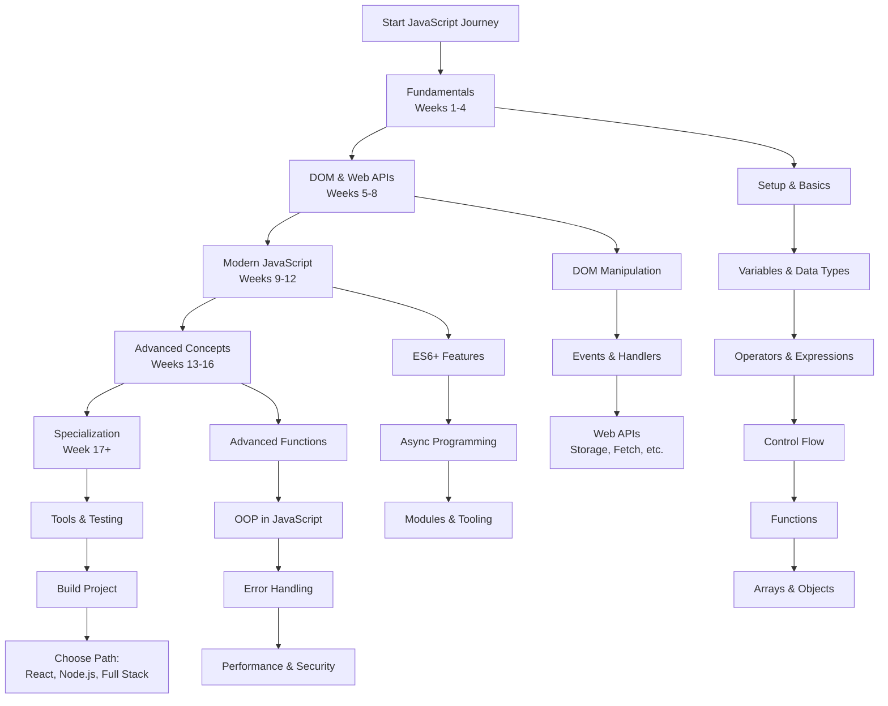

# JavaScript Developer Learning Path: A Structured Curriculum

This comprehensive roadmap provides a structured approach to mastering JavaScript development. The curriculum is designed sequentially, with each module building upon previous knowledge to ensure a solid foundation and progressive skill development.

---

## Phase 1: JavaScript Fundamentals (Weeks 1-4)

*   [**Module 1: Introduction & Development Environment**](https://github.com/example/js-intro/#readme)
    *   JavaScript Overview: History, Evolution, and Role in Web Development
    *   JavaScript Ecosystem: Browser Engines, Node.js, and Runtime Environments
    *   Setting Up Development Environment: VS Code, Browser DevTools
    *   Writing and Executing JavaScript: Inline, Internal, and External Scripts
    *   "Hello World" Examples in Browser and Node.js Environments

*   [**Module 2: Variables and Data Types**](https://github.com/example/js-variables/#readme)
    *   Variable Declaration: `var`, `let`, and `const` (Differences and Best Practices)
    *   Primitive Data Types: `String`, `Number`, `Boolean`, `undefined`, `null`, `Symbol`, `BigInt`
    *   Dynamic Typing and Type Coercion
    *   Reference Types: Objects, Arrays, Functions
    *   Type Checking: `typeof` Operator and `instanceof`

*   [**Module 3: Operators and Expressions**](https://github.com/example/js-operators/#readme)
    *   Arithmetic Operators: `+`, `-`, `*`, `/`, `%`, `**`, `++`, `--`
    *   Assignment Operators: `=`, `+=`, `-=`, `*=`, `/=`
    *   Comparison Operators: `==`, `===`, `!=`, `!==`, `>`, `<`, `>=`, `<=`
    *   Logical Operators: `&&`, `||`, `!` (Including Short-Circuit Evaluation)
    *   Ternary Operator: `condition ? expr1 : expr2`
    *   Special Operators: `typeof`, `instanceof`, `in`

*   [**Module 4: Control Flow Statements**](https://github.com/example/js-control-flow/#readme)
    *   Conditional Statements: `if`, `else if`, `else`, and Switch Statements
    *   Truthy and Falsy Values in JavaScript
    *   Looping Structures: `for`, `while`, `do-while` Loops
    *   Loop Control: `break`, `continue`, and Labels
    *   Error Handling: `try-catch-finally` Blocks

*   [**Module 5: Functions**](https://github.com/example/js-functions/#readme)
    *   Function Declarations vs. Function Expressions
    *   Parameters and Arguments: Default Parameters, Rest Parameters
    *   Return Values and Function Scope
    *   Arrow Functions and Their Characteristics
    *   Immediately Invoked Function Expressions (IIFE)

*   [**Module 6: Arrays and Objects**](https://github.com/example/js-arrays-objects/#readme)
    *   Arrays: Creation, Access, and Common Methods (`push`, `pop`, `shift`, `unshift`, `slice`, `splice`)
    *   Array Iteration: `forEach`, `map`, `filter`, `reduce`, `find`
    *   Objects: Properties, Methods, and Object Literal Syntax
    *   Object Access: Dot Notation vs. Bracket Notation
    *   Built-in Object Methods

---

## Phase 2: DOM Manipulation & Web APIs (Weeks 5-8)

*   [**Module 7: Document Object Model (DOM)**](https://github.com/example/js-dom/#readme)
    *   Understanding the DOM Tree Structure
    *   Selecting Elements: `getElementById`, `querySelector`, `querySelectorAll`
    *   Traversing the DOM: Parent, Child, and Sibling Relationships
    *   Creating, Modifying, and Removing Elements
    *   Working with Attributes, Classes, and Styles

*   [**Module 8: Events and Event Handling**](https://github.com/example/js-events/#readme)
    *   Event Types: Mouse, Keyboard, Form, and Window Events
    *   Event Listeners: `addEventListener` and `removeEventListener`
    *   Event Object Properties and Methods
    *   Event Propagation: Bubbling and Capturing Phases
    *   Event Delegation Pattern
    *   Preventing Default Behavior and Stopping Propagation

*   [**Module 9: Web APIs and Browser Storage**](https://github.com/example/js-web-apis/#readme)
    *   Web Storage API: `localStorage` and `sessionStorage`
    *   Fetch API for HTTP Requests
    *   Timers: `setTimeout`, `setInterval`, and `clearTimeout`
    *   Geolocation API and Other Browser APIs
    *   Working with Dates using Date Object

---

## Phase 3: Modern JavaScript Features (Weeks 9-12)

*   [**Module 10: ES6+ Features**](https://github.com/example/js-es6/#readme)
    *   Block Scoping with `let` and `const`
    *   Template Literals and String Interpolation
    *   Destructuring Assignment (Arrays and Objects)
    *   Spread and Rest Operators (`...`)
    *   Enhanced Object Literals
    *   Optional Chaining (`?.`) and Nullish Coalescing (`??`)

*   [**Module 11: Asynchronous JavaScript**](https://github.com/example/js-async/#readme)
    *   Callback Functions and Callback Hell
    *   Promises: Creation, Chaining, and Error Handling
    *   `async/await` Syntax for Asynchronous Operations
    *   Promise Methods: `Promise.all`, `Promise.race`, `Promise.allSettled`
    *   Handling Multiple Asynchronous Operations

*   [**Module 12: Modules and Modern Tooling**](https://github.com/example/js-modules/#readme)
    *   ES6 Modules: `import` and `export` Statements
    *   Module Patterns and Namespacing
    *   Introduction to Package Managers (npm/yarn)
    *   Bundlers: Webpack, Vite, or Parcel
    *   Transpilers: Babel and TypeScript Basics

---

## Phase 4: Advanced JavaScript Concepts (Weeks 13-16)

*   [**Module 13: Advanced Functions and Closures**](https://github.com/example/js-advanced-functions/#readme)
    *   Execution Context and Call Stack
    *   Scope Chain and Lexical Scoping
    *   Closures and Their Practical Applications
    *   Higher-Order Functions and Function Composition
    *   Recursion and Memoization

*   [**Module 14: Object-Oriented Programming in JavaScript**](https://github.com/example/js-oop/#readme)
    *   Constructor Functions and the `new` Keyword
    *   Prototypes and Prototypal Inheritance
    *   ES6 Classes: Syntax, Inheritance, and Static Methods
    *   `this` Keyword Behavior and Binding Methods
    *   Mixins and Composition vs. Inheritance

*   [**Module 15: Error Handling and Debugging**](https://github.com/example/js-error-handling/#readme)
    *   Error Types: `Error`, `SyntaxError`, `ReferenceError`, `TypeError`
    *   Custom Error Classes
    *   Debugging Techniques: Console Methods, Breakpoints, Debugger Statement
    *   Logging Strategies and Error Tracking

*   [**Module 16: Performance and Security**](https://github.com/example/js-performance/#readme)
    *   Memory Management and Garbage Collection
    *   Performance Optimization Techniques
    *   Common Security Vulnerabilities (XSS, CSRF)
    *   Best Practices for Secure JavaScript Code

---

## Phase 5: Professional Development & Specialization

*   [**Module 17: Development Tools and Testing**](https://github.com/example/js-tools/#readme)
    *   Version Control with Git and GitHub
    *   Testing Frameworks: Jest, Mocha, or Jasmine
    *   Linting and Code Formatting (ESLint, Prettier)
    *   Debugging Tools and Browser DevTools Mastery
    *   Continuous Integration/Deployment Basics

*   [**Module 18: Capstone Project & Specialization Path**](https://github.com/example/js-capstone/#readme)
    *   **Build a Complete Web Application** (Todo App, Weather App, or E-commerce Site)
    *   **Choose a Specialization Path:**
        *   **Frontend Development:** React, Vue, or Angular Framework
        *   **Backend Development:** Node.js, Express.js, and Databases
        *   **Full Stack Development:** MERN/MEAN Stack (MongoDB, Express, React/Angular, Node.js)
        *   **Mobile Development:** React Native or Progressive Web Apps (PWAs)

---

## Additional Resources

*   [**JavaScript Style Guides**](https://github.com/example/js-style-guides/#readme) - Airbnb, Google, and Standard JavaScript Style Guides
*   [**JavaScript Algorithms and Data Structures**](https://github.com/example/js-algorithms/#readme) - Common Algorithms and Data Structure Implementations
*   [**JavaScript Interview Preparation**](https://github.com/example/js-interview/#readme) - Common Interview Questions and Coding Challenges
*   [**JavaScript Community Resources**](https://github.com/example/js-community/#readme) - Blogs, Podcasts, Conferences, and Learning Platforms

**Note:** Each module includes practical exercises, coding challenges, and mini-projects to reinforce learning. The estimated timeline is flexible and can be adjusted based on individual learning pace and prior experience.
